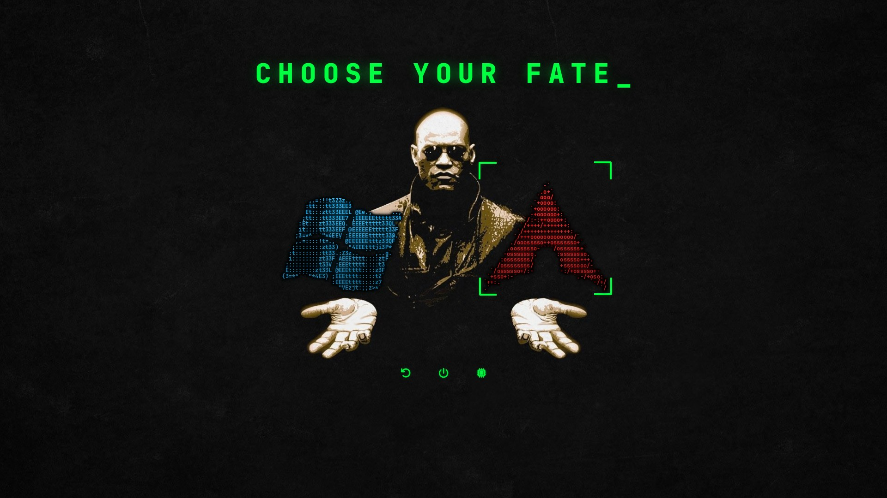

# rEFInd — Choose Your Fate

> *"You take the blue pill… the story ends, you wake up in Windows. You take the red pill… you stay in Arch, and I show you how deep the rabbit hole goes."*

A [rEFInd](https://www.rodsbooks.com/refind/) theme where Morpheus holds out your two operating systems — rendered as glowing neofetch-style ASCII art. **Windows is the blue pill, Linux is the red pill.**



## What's in it

- Morpheus background from **Matrix-rEFInd**, with a terminal-green `CHOOSE YOUR FATE_` headline
- ASCII-art OS icons in the spirit of **refind-efifetch**, re-rendered crisp at native size and tinted pill-blue / pill-red
- Terminal-style `⌜ ⌟` selection brackets and green reboot / shutdown / firmware buttons
- Native backgrounds for **16:9** (1920×1080) and **16:10** (1920×1200) screens, so the pills sit on the hands instead of drifting

## Install

```bash
git clone https://github.com/SammyNashed/refind-choose-your-fate
cd refind-choose-your-fate
sudo ./install.sh           # 16:9 screens
sudo ./install.sh --16x10   # 16:10 screens (1920x1200, 2560x1600)
```

The script copies the theme to `EFI/refind/themes/`, comments out any previous `include themes/...` line, and backs up `refind.conf` first.

### Getting the pills in the right hands

The theme is built for **exactly two** entries (`max_tags 2`). rEFInd shows manual `menuentry` blocks in file order, then auto-detected ones — so for Windows on the left (blue) and Linux on the right (red), declare both as manual entries with Windows first:

```
scanfor manual,external

menuentry "Windows" {
    icon   /EFI/refind/themes/refind-choose-your-fate/icons/os_win.png
    volume <PARTUUID of the Windows ESP>
    loader /EFI/Microsoft/Boot/bootmgfw.efi
}
menuentry "Arch Linux" {
    icon   /EFI/refind/themes/refind-choose-your-fate/icons/os_arch.png
    ...
}
```

## Rebuilding the art

Everything except the Morpheus photo is generated: `python3 build_bg.py && python3 build_icons.py` (needs Pillow, JetBrainsMono Nerd Font, and the logo text in `src/`). `build_icons.py` also writes `preview*.jpg` using rEFInd's own layout math, so you can check placement without rebooting.

## Credits

- [Matrix-rEFInd](https://github.com/Yannis4444/Matrix-rEFInd) by Yannis Vierkötter — background and the pills-in-hands idea
- [refind-efifetch](https://github.com/CriticalPulsar/refind-efifetch) by Evan Nosich — ASCII-logo icons idea
- ASCII logos from [fastfetch](https://github.com/fastfetch-cli/fastfetch) / neofetch

MIT — see [LICENSE](LICENSE). The Morpheus still is from *The Matrix* (Warner Bros.) and isn't covered by the license.
